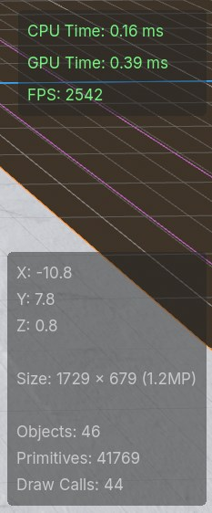
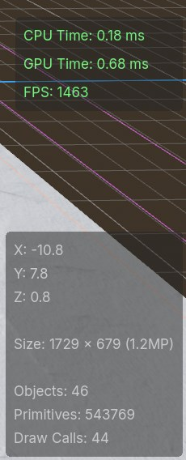

+++
title = "First Steps in Snow Shader"
date = 2025-06-17
#updated = 2025-01-01
draft = false

[extra]
lang = "en"
toc = true
comment = false
copy = true
outdate_alert = false
outdate_alert_days = 120
math = false
mermaid = false
featured = false
reaction = false
+++

I created this effect in the Godot game engine that simulates pressed snow on the ground:

{{ video(src="demo-1.mp4") }}

The demonstration here is a little basic, but the video shows how the ground reacts to the geometry of nearby objects and has an indentation effect. Also, as time passes the snow gets filled back in.

There's a couple different pieces that go into making this effect work, so I'm writing a post here to share the process of how it was put together and the computer graphics concepts behind it.

This project was made in Godot, but plenty of these ideas apply to other game engines as well. The code for the Godot project is linked at the bottom of this post.

## The inspiration for this shader

I started creating this snow shader inspired by the following effect from Genshin Impact:

{{ video(src="genshin-sand.mp4", width=400) }}

Specifically, I wanted to recreate the way the sand follows the character movements accurately and how the sand gets pushed around with a 3D parallax effect. Since Genshin Impact is meant to run on mobile devices we know that the shader is reasonably performant too, so I tried to keep that in mind when thinking about the technical approach.

To mix things up a bit I decided to create a snow effect instead of sand, but with some parameter tweaks and color/texture changes we can definitely recreate this on any sort of pressable ground.

## Using physics collisions to get impact locations

The first thing we'll need to figure out is how to capture the impact location of objects against the snow surface. My initial idea was to use the physics collisions that are already happening on the ground. We could grab the location of those collisions, and then pass the coordinates to the shader as an array of `Vector2`s.

Implementing this was fairly straightforward and easy to do, and visualizing these points in a basic shader resulted in the following:

{{ video(src="collision-impact-locations.mp4") }}

While this approach is pretty performant and works at a basic level, the drawback here is that the resolution of objects impacting the ground is limited to a single point. With these single points the best we can do is have uniformly shaped impacts, which you can see in the video.

This isn't necessarily a dealbreaker, and games will often use just a static footprint shape for this type of effect. The look I'm trying to go for however is dynamic and can react to shapes other than just footprints, so we'll need a different approach.

## Using the depth buffer from a camera

The approach I've gone with instead is to get the distance between the objects and snow surface using the depth buffer from two orthographic cameras.

The depth buffer is used in the graphics pipeline to keep track of the depth of 3D objects at each pixel during the process of drawing the fragments of each triangle. These depth values are often used to prevent overdraw by testing new drawn objects against what exists in the depth buffer at each pixel. If the object is opaque and isn't closer to the camera than what exists in the buffer, then we can skip that pixel since it's behind an object that's already drawn.

For our effect though, we can make use of the depth buffer to get the data we need. One orthographic camera can be placed below the scene to get the depth of the objects and another orthographic camera can be placed above the ground to get the depth of the surface itself. Given these two values, we'll be able to know how close each object is to the surface.

{{ centered_image(src="orthographic-cameras.jpg") }}

It might seem expensive to render the scene from two new perspectives, but so long as we disable everything we don't need it'll actually be fairly cheap. We can disable expensive effects like lighting and shadows since all we need are the depth values. The resulting render from our cameras will be far more lightweight than a normal render pass.

We can also configure the cameras to only render meshes that are on a specific mask layer. We'll need to configure models like our player and interactive objects to be on this mask layer, but once we do we can isolate this effect to only a few important meshes and exclude everything else. Reducing the amount of meshes in this way will reduce the amount of triangles which should keep this effect performant.

{{ centered_image(src="actor-layer-2.jpg") }}

{{ centered_image(src="stump-layer-1.jpg") }}

## Getting the depth texture in Godot

So now that we know how to get the impact locations, it's time to implement it. In Godot there are two main ways to get our cameras to output the values of the depth buffer as a depth texture.

One way is to use a quad mesh with a vertex shader that moves the vertices of the mesh to cover the view of the camera and then display the depth texture on that mesh. Instructions for doing that can be found on the Godot wiki here:  
<https://docs.godotengine.org/en/stable/tutorials/shaders/advanced_postprocessing.html>

Another way is to use the [Compositor](https://docs.godotengine.org/en/stable/tutorials/rendering/compositor.html) which lets you to run compute shaders for post processing effects on a viewport. "Compositor Effects" can be defined with custom classes in script and then added to the compositor on the cameras.

Either method works fine, though I found the compositor to be better suited for this purpose since it isolates the effect to the orthographic cameras and generally has greater flexibility and power.

The compositor interacts with the lower level Godot graphics APIs more directly, so we'll need to compile the shader code, create the pipeline, bind the textures to GPU memory, and dispatch the compute command list ourselves.

```gd
var shader_file := load("uid://ccsu7g7cr3j5i") # res://scripts/depth_effect.glsl
var shader_spirv: RDShaderSPIRV = shader_file.get_spirv()
shader = rd.shader_create_from_spirv(shader_spirv)

if shader.is_valid():
	pipeline = rd.compute_pipeline_create(shader)
```

In the above code we can see how Godot's lower level "RenderingServer" works, which at times resembles a graphics API. It's generally much simpler than how a graphics API may look but still gives us access to very powerful functionality.

We first load the shader as SPIR-V, which is a standardized intermediate shader representation, and compile it. After that we create a compute pipeline object which defines a pipeline for doing compute shader work. This compute pipeline allows us to run a compute shader that will simply write the depth values out to a texture.

```gd
var color_image: RID = render_scene_buffers.get_color_layer(view)
var depth_texture: RID = render_scene_buffers.get_depth_layer(view)

var color_uniform := RDUniform.new()
color_uniform.uniform_type = RenderingDevice.UNIFORM_TYPE_IMAGE
color_uniform.binding = 0
color_uniform.add_id(color_image)

var depth_uniform := RDUniform.new()
depth_uniform.uniform_type = RenderingDevice.UNIFORM_TYPE_SAMPLER_WITH_TEXTURE
depth_uniform.binding = 1
depth_uniform.add_id(sampler)
depth_uniform.add_id(depth_texture)

var uniform_set := UniformSetCacheRD.get_cache(shader, 0, [color_uniform, depth_uniform])
```

We then bind what we need to GPU memory. Here we're binding an "image" and a "sampler with texture" to a set. The "texture" contains the data of our texture and the "sampler" defines how we read it. An "image" can be both written to and read from. The `color_image` here is both the input of the viewport as well as the image output we will be writing to.

```gd
var compute_list := rd.compute_list_begin()
rd.compute_list_bind_compute_pipeline(compute_list, pipeline)
rd.compute_list_bind_uniform_set(compute_list, uniform_set, 0)
rd.compute_list_set_push_constant(compute_list, push_constant.to_byte_array(), push_constant.size() * 4)
rd.compute_list_dispatch(compute_list, x_groups, y_groups, z_groups)
rd.compute_list_end()
```

Lastly, we set up the compute command list that will get sent to the GPU for execution.

The two orthographic cameras will now output the depth. To capture this output in Godot I've added the cameras as children of two [SubViewport](https://docs.godotengine.org/en/stable/classes/class_subviewport.html) nodes which lets us use the camera output as a render texture.

## Further processing the "impact" texture

So from here we *could* pass these depth textures of the above and below cameras directly into the final snow effect shader, but it'll be useful to process them as a separate step for debugging. Debugging shaders can sometimes be tricky so this intermediary step will help verify that the inputs to the final part of the snow effect are right.

In this step I generate the "impact" texture which will hold information at each pixel of what the height of the snow should be. A value of 1.0 will be max snow height and a value of 0 will be the floor of the snow height.

{{ video(src="close-to-snow-surface.mp4") }}

For a better looking effect I've also blurred the edges to make the impact location look more smooth. I also keep track of the output of previous frame to show a trail of impacted snow over time, and readd white to the texture to return the snow to max height over time.

And with that we get the following result:

{{ video(src="final-impact-texture.mp4") }}

## Impacted snow parallax effect

Now with the impact map ready as an input, we can create the actual visual effect for the snow ground. This effect involves making the ground look like snow is getting indented and pushed around. There's two approaches we can take for achieving this effect, one is to do this in a vertex shader and the other is to do this in a fragment shader.

In a vertex shader, we can use the impact map as a displacement map and move vertices up in space based on the value of the map. This effect looks like this:

{{ video(src="displacement.mp4") }}

Since the actual mesh vertices are moving and the geometry is being deformed, the snow dent is spatially accurate without needing any visual tricks. It does require a decent amount of vertices in the mesh for the effect to look good however, which are vertices that the mesh otherwise wouldn't have needed to define its original shape. Each extra vertex / additional triangle adds a very tiny cost, but in large quantities they can add up to a significant amount of cost for the effect.

The other approach would be to try to create the snow indentation in the fragment shader instead. One way to do this is to use parallax mapping, which looks okay except for up close at harsh grazing angles. For a snow footprint effect, that kind of angle won't be very common. The result looks like this:

{{ video(src="parallax.mp4") }}

For this parallax mapping effect I used an existing implementation online for reference, though the original code was written for use in the node based shader editor which I've adapted to use in gdshader code:  
<https://godotshaders.com/shader/bumpoffset-visualshadernode-4-4/>

The parallax mapping approach looks less blocky than using vertex displacement, and doesn't need to add any extra vertices to the ground mesh. This shader will run for every fragment however and since the ground will likely take up a large portion of the screen, the amount of fragments can potentially outnumber the amount of vertices.

Hypothetically both approaches have their pros and cons on performance. With some rough profiling in different scenarios like at a grazing angle, filling the screen with the ground, and having the camera far away, it seems like the fragment shader with parallax mapping does around 70% better (~2500 fps vs ~1500 fps) than the vertex shader displacement map with a 500x500 grid of quads (500,000 primitives).

<div style="width: 400px; margin: 0 auto; display: flex; gap: 16px;">
  
  
</div>

Ultimately I decided to go with the fragment shader approach because it has better performance, doesn't need to add extraneous geometry, and looks smoother.

## The final result

And so that leaves us with the final result showed at the start of this post:

{{ video(src="demo-2.mp4") }}

I think this works well as a proof of concept but there are a couple things that can definitely be improved.

One issue is that the effect is not framerate independent. Shaders will run every frame, and so the shader code for filling impacted snow will vary in speed depending on FPS. Someone playing on 60 FPS will get half the snow regeneration speed of someone playing on 120 FPS for example.

Visually, the effect could also have some improvements. The Genshin shader for example has shadows inside of the indentation, there's a bump around the edges of the indentation, and there's also a general bumpiness that gives the indentations a more organic/realistic look.

Another big improvement would be to have the above and below cameras follow the character instead of be tied to the mesh itself. This would decrease the amount of memory we need to store depth information for the impact locations since the cameras only need to capture the range of motion for each actor.

Finally, the usability of this effect could be improved. Knowing the inner workings of this shader shouldn't be necessary for it's use and only the necessary configuration should be exposed to set it up.

I'd like eventually publish this effect to the Godot asset library for general use, though likely after implementing some of these improvements along with another few iterations on the effect.

---

**Github Link:** <https://github.com/BradleyCai/snow-shader>
